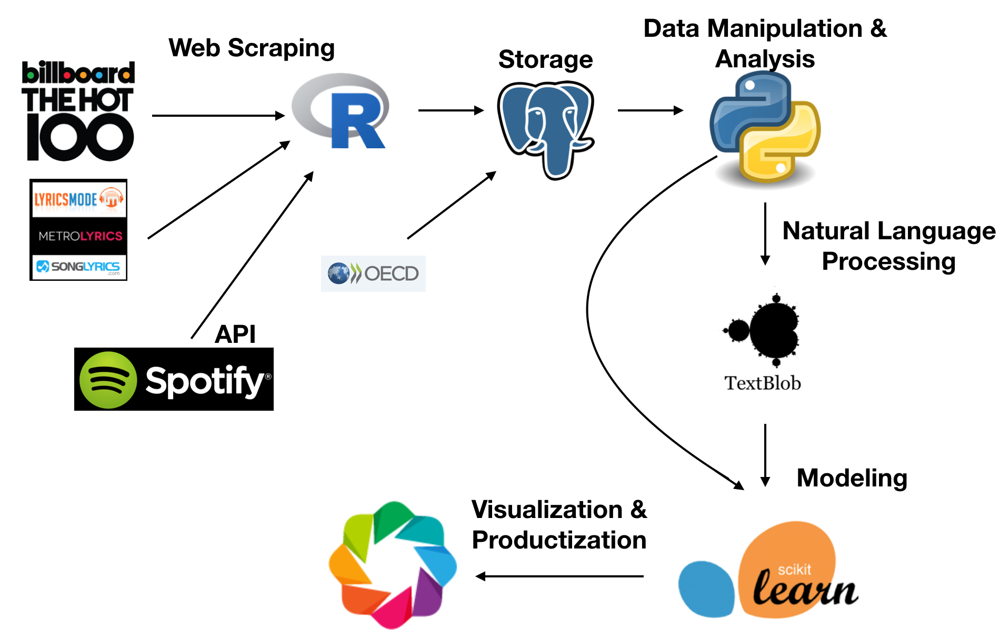
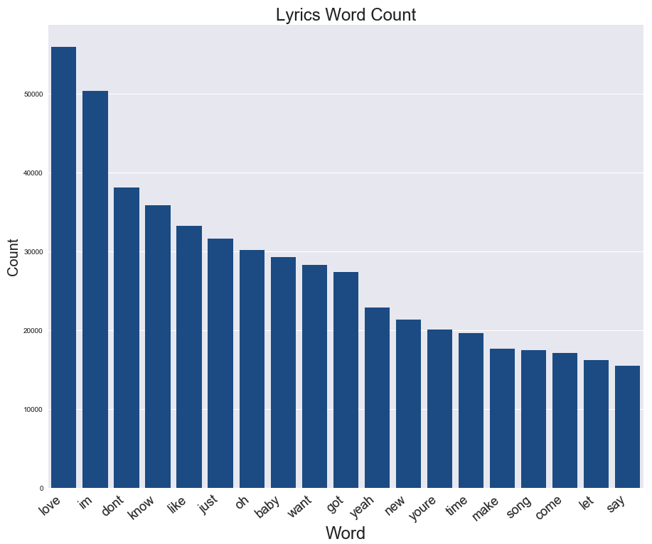
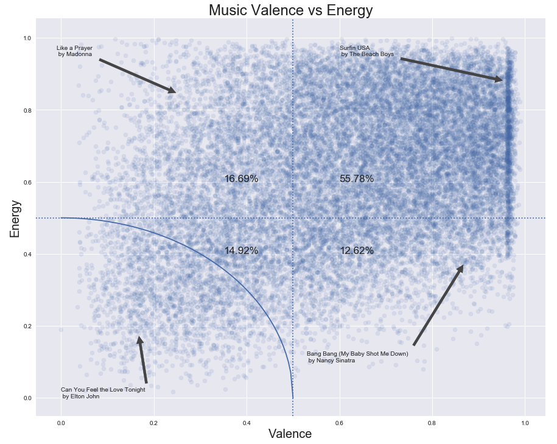
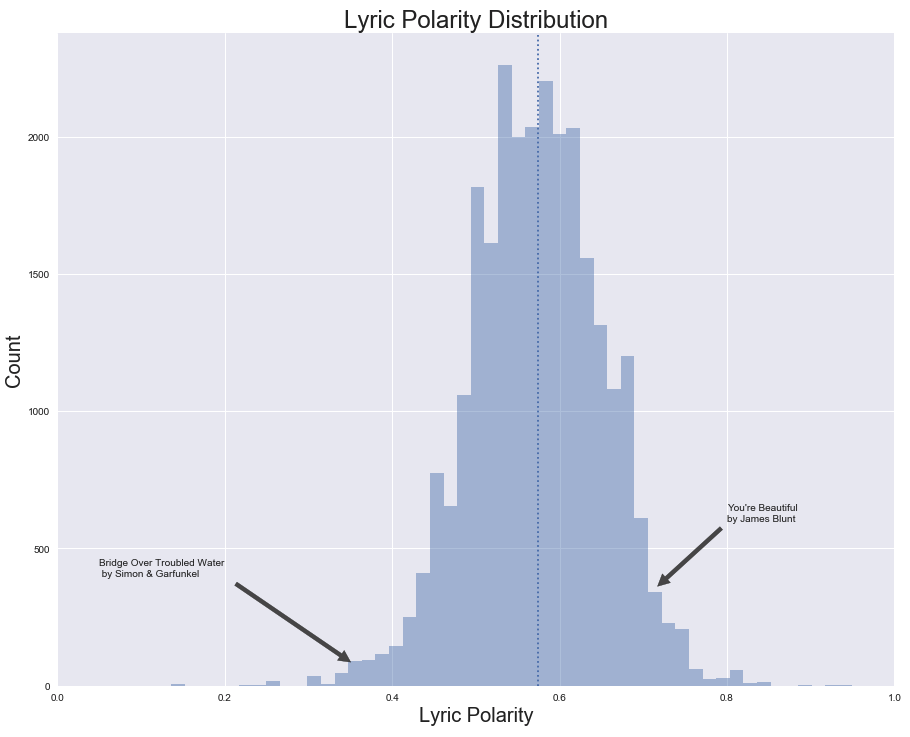
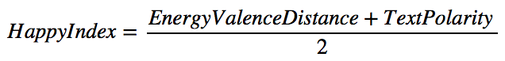

# What Exactly Are We Turning Down for Again?

__Abstract:__ This project is an analysis of happiness in music and the external driving factors. 

__Hypothesis:__ Music is a representation of our mood. Therefore when the national mood is high, people listen to happy music.

__Results:__ Using logistic regression, I discovered a negative relationship between the consumer confidence index and when the No. 1 billboard hit is a happy song. I found that people are especially likely to listen to happy music following a national tragedy.

See this work as a presentation in [slide format](https://github.com/akraemer007/what_exactly_are_we_turning_down_for_again/blob/master/what_are_we_presentation.pdf).

[See the video](https://youtu.be/3br5HLVSOK8).

# Background & Motivation
Music is part of our daily lives. We listen to it when we work out. We listen to it when we're sad. This project attempts to predict what type of popular music is listened to based on external factors. For instance, if the Consumer Confidence Index is up, are the top Billboard hits happy songs? Conversely, if the Consumer Confidence Index is down, do people stay indoors and listen to The Cure and Morrissey on repeat?

Also, why on earth was *[The Macarena](https://www.youtube.com/watch?v=anzzNp8HlVQ)* the No. 1 Billboard hit for 14 straight weeks in 1996?

# Data used 

| Source                                                                                                    | Description                               | Format                                                                        |
|-----------------------------------------------------------------------------------------------------------|-------------------------------------------|-------------------------------------------------------------------------------|
| [Billboard](https://github.com/dbfowler/billboard_volatility/blob/master/Raw%20Data/all_charts.csv)       | Billboard Top 100 List going back to 1958 | CSV                                                                           |
| [Consumer Confidence Index](https://data.oecd.org/leadind/consumer-confidence-index-cci.htm)  | Monthly Index value going back to 1960    | CSV                                                                           |
| [Spotify API](https://developer.spotify.com/web-api/)                                                     | Song valence and energy scores            | [API](https://github.com/charlie86/spotifyr)                                  |
| [MetroLyrics](www.metrolyrics.com/), [songlyrics](www.songlyrics.com/), [lyricsmode](www.lyricsmode.com/) | Lyrics billboard hits                     | [Scraped](https://github.com/walkerkq/musiclyrics/blob/master/01_songscrape.R)|

# Analysis methods
### Pipeline

### Top lyrics
The lyrics in pop songs are, on average, positive. The most frequenly used words sound almost like a pop song when read in order.

Spotify’s API contains a number calculated of musical qualities of a song. In this analysis, *Energy* - a score measuring intensity of a track and Valence - a score measuring how positive / peppy a track sounds — are used as representations of the musical happiness of a song.

The lyrical happiness of a song was calcualted by using the sentiment of a song’s lyrics. This was done by using the natural language processing Python package *TextBlob*. In this analysis, lyrical happiness is called *Text Polarity*.

Comined musical and lyrical scores to create an aggregate musical happiness score, which I called the *Happy Index*:

# Predicting No. 1 hits Happiness
 
A Savitzky-Golay filter was applied to the CCI to smooth the curve. Then the gradient of the curve was taken

The gradient was used as the feature to predict whether the No. 1 Billboard hit was a happy or sad song. 

My model resulted in an r-squared of .77.

# Future improvements
- Try other economic indicators outside of the CCI
- Put interactive web-app online
# Acknowledgements
First of all, thank you to all of the students, instructors, and staff at [Galvanize](https://www.galvanize.com/austin). I learned an incredible amount in three months. Also, thank you to the following data scientists for inspiration for the project.
[50 Years of Pop Music](http://kaylinwalker.com/50-years-of-pop-music/)
[Billboard Volatility](http://decibelsanddecimals.com/dbdblog/2017/1/8/billboard-volatility.html)
[Blue Christmas: A data-driven search for the most depressing Christmas song](https://caitlinhudon.com/2017/12/22/blue-christmas/)

